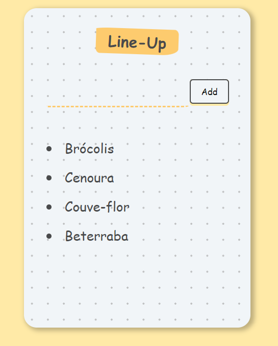

# Lineup

A simple to-do list made using React and NextJS.





## Step 1 - Dependencies

You will need:

* [Git](http://git-scm.com/downloads)
* [Node](https://nodejs.org/) 
* [Yarn](https://yarnpkg.com/) 

Please install them if you don't have them already.

## Step 2 - Clone the repository:

From the command line, clone the repository:

```sh
$ git clone https://github.com/mylenaverspeelt/lineup-app.git
```

## Step 3 - Run the app

Once the dependencies are installed, you can run the app:

```sh
cd lineup-app
yarn dev
```
Your browser should open up the running app, or you can access: http://localhost:3000/

Developed by: Mylena Verspeelt 🦜
 
